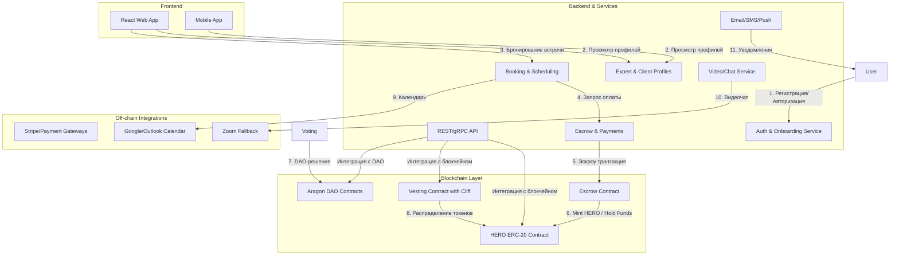

# Документ технических спецификаций (TSD)

**Проект:** The Time of Heroes  
**Предмет:** Смарт-контракты для токена HERO, vesting с cliff и интеграция с Aragon DAO  
**Версия:** 1.0  
**Дата:** 2025-07-10

---

## 1. Введение

**1.1 Назначение**  
Этот документ описывает технические спецификации для разработки и интеграции следующих компонентов:

- Контракт ERC-20 токена HERO
- Контракт vesting с поддержкой cliff и линейного распределения
- Механизмы управления ролями и доступом
- Интеграция с каноническим DAO на основе Aragon (Token Manager, Voting, Finance)

**1.2 Область применения**  
Документ предназначен для команды Solidity разработчиков и SRE/DevOps, ответственных за деплой и поддержку контрактов на Ethereum и l2 rollups (если бизнес пойдем в L2)

**1.3 Определения**

- **ERC-20**: стандарт токена в экосистеме Ethereum - EVM машине в целом
- **DAO**: децентрализованная автономная организация
- **Vesting**: механизм поэтапного предоставления права собственности на токены в течение заранее определённого периода
- **Cliff**: период, в течение которого выпуск токенов по графику недоступен
- **Aragon**: фреймворк для создания и управления DAO

---

## 2. Архитектура системы

### 2.1 Компоненты системы и взаимодействие ToH ↔ Aragon DAO

```mermaid
graph TB
    subgraph "Time of Heroes Protocol"
      THToken[HERO Token<br/>(ERC-20)]
      VestingContract[Vesting Contract<br/>with Cliff & Linear Release]
      ToHBackend[ToH Backend<br/>API & UI]
      Escrow[Escrow & Payment<br/>(Smart Contract)]
      AragonPlugin[Aragon Plugin<br/>(TokenManager/Voting/Finance)]
    end

    subgraph "Aragon DAO"
      DAOFactory[DAO Factory]
      TokenManager[Token Manager]
      Voting[Token Voting]
      Finance[Finance App]
    end

    User[End-User<br/>(Client/Expert)]
    Admin[Platform Admin]

    User -->|1. Покупка консультации<br/>& оплата| Escrow
    Escrow -->|2. Mint HERO| THToken
    Escrow -->|3. Передача средств| VestingContract
    ToHBackend -->|4. UI-управление| VestingContract
    ToHBackend -->|5. Интеграция| AragonPlugin

    Admin -->|6. Настройка параметров| DAOFactory
    DAOFactory -->|7. Установка приложений| TokenManager
    DAOFactory -->|7. Установка приложений| Voting
    DAOFactory -->|7. Установка приложений| Finance

    THToken -->|8. Регистрация в| TokenManager
    VestingContract -->|9. Фандинг казны| Finance
    Voting --->|10. Голосования по<br/>чеканке/сжиганию| THToken

    Finance -->|11. Расходы из казны| Escrow
```

### 2.2 Общая архитектура платформы ToH



### 2.3 Компоненты высокого уровня

- **Контракт HERO Token**
  - Mintable (минт новых токенов)
  - Pausable (приостановка/возобновление переводов)
  - Role-based access control (OpenZeppelin `AccessControlEnumerable`)
- **Контракт Vesting**
  - Создание графиков вестинга с клиффом
  - Хранение и выпуск токенов по расписанию
- **Aragon DAO**
  - Token Manager (регистрация и управление токенами)
  - Voting (голосование по предложениям)
  - Finance (казна DAO и управление расходами)

### 2.4 Сценарий развёртывания

1. Развёртывание контракта HERO Token
2. Развёртывание контракта Vesting
3. Чеканка начальных аллокаций (vesting schedules, командный кошелёк)
4. Создание DAO через Aragon Factory и установка приложений
5. Регистрация токена HERO в Token Manager приложения DAO

---

## 3. Контракт токена HERO

### 3.1 Интерфейс

```solidity
interface IERC20Mintable {
    function mint(address to, uint256 amount) external;
}
```

### 3.2 Роли

- `DEFAULT_ADMIN_ROLE`
- `MINTER_ROLE` — разрешение на вызов `mint()`
- `PAUSER_ROLE` — разрешение на вызов `pause()`/`unpause()`

### 3.3 Переменные хранения

- `uint256 public cap` — максимальное количество токенов в обращении
- `mapping(address => bool) public blacklist` — адреса, которым запрещены переводы

### 3.4 Основные функции

| Функция                            | Видимость | Описание                                            |
| ---------------------------------- | --------- | --------------------------------------------------- |
| `mint(address to, uint256 amount)` | external  | Выпускает новые токены, доступно только MINTER_ROLE |
| `pause()` / `unpause()`            | external  | Приостанавливает или возобновляет переводы токенов  |
| `transfer` / `transferFrom`        | override  | Проверка на паузу и чёрный список перед переводом   |

### 3.5 События

- `event Mint(address indexed to, uint256 amount)`
- `event Paused(address account)`
- `event Unpaused(address account)`

### 3.6 Безопасность и оптимизация газа

- Использовать стандартизованные библиотеки OpenZeppelin
- Фиксировать `cap` = 1_000_000_000 HERO (также `totalSupply` может быть изменен по согласованию токеномики с бизнесом)
- Избегать динамических массивов

---

## 4. Вестинг и клифф

**Описание:**  
Вестинг — это механизм поэтапного выпуска токенов бенефициарам. Клифф (cliff) задаёт период, в течение которого выпуск недоступен, а после его окончания токены высвобождаются линейно в течение заданного срока.

---

### 4.1 Использование OpenZeppelin VestingWallet

OpenZeppelin Contracts предоставляет готовый контракт [`VestingWallet`](https://github.com/OpenZeppelin/openzeppelin-contracts/blob/master/contracts/finance/VestingWallet.sol), реализующий безопасный вестинг токенов:

```solidity
// SPDX-License-Identifier: MIT
pragma solidity ^0.8.0;

import "@openzeppelin/contracts/finance/VestingWallet.sol";

contract HEROVesting is VestingWallet {
    constructor(
        address beneficiary_,
        uint64 startTimestamp_,
        uint64 cliffDurationSeconds_,
        uint64 durationSeconds_
    )
        VestingWallet(
            beneficiary_,
            startTimestamp_,
            cliffDurationSeconds_,
            durationSeconds_
        )
    {}
}
```

- `beneficiary_` — адрес получателя выпусков
- `startTimestamp_` — метка времени начала вестинга (UNIX)
- `cliffDurationSeconds_` — длительность клиффа в секундах
- `durationSeconds_` — общая длительность вестинга (в секундах)

Контракт хранит выпущенные суммы и выпускает токены вызовом:

```solidity
function release(address token) public virtual {
    uint256 releasable = vestedAmount(token, uint64(block.timestamp)) - released(token);
    released[token] += releasable;
    SafeERC20.safeTransfer(IERC20(token), beneficiary(), releasable);
    emit ERC20Released(token, releasable);
}
```

---

### 4.2 Best Practices и рекомендации

- **SafeERC20:** всегда используйте `SafeERC20` для переводов, чтобы учесть нестандартные реализации ERC-20.
- **Immutable параметры:** объявляйте `start`, `cliff` и `duration` как `immutable` для оптимизации газа.
- **ReentrancyGuard:** при сложных логиках выпуска (например, мульти­токены) оберните `release` в `nonReentrant`.
- **Revocable Vesting:** если нужна возможность отзыва, можно воспользоваться `TokenVesting` из OpenZeppelin v3 или реализовать метод `revoke(address beneficiary)` вручную.
- **Точное округление:** вычисляйте `vestedAmount` так:

  ```solidity
  if (timestamp < start + cliff) {
      return 0;
  } else if (timestamp >= start + duration) {
      return totalAllocation;
  } else {
      return (totalAllocation * (timestamp - start)) / duration;
  }
  ```

  и в конце выдавайте остаток, чтобы не потерять токены из-за целочисленного деления.

- **Тесты:** покрывайте сценарии до клиффа, на середине, в конце вестинга, при ревоке и повторных вызовах `release`.

---

### 4.3 Альтернатив: TokenVesting из OZ v3

```solidity
import "@openzeppelin/contracts@3.4.0/drafts/TokenVesting.sol";

contract HEROTokenVesting is TokenVesting {
    constructor(
        address beneficiary_,
        uint256 start_,
        uint256 cliffDuration_,
        uint256 duration_,
        bool revocable_
    )
        TokenVesting(
            beneficiary_,
            start_,
            cliffDuration_,
            duration_,
            revocable_
        )
    {}
}
```

- `TokenVesting` из OZ v3 поддерживает параметр `revocable` из коробки.
- API: `release(IERC20 token)` и `revoke(IERC20 token)`.

---

### 4.4 Рекомендации по тестированию

1. **До клиффа:** `releasableAmount()` == 0
2. **После клиффа:** проверка частичных выпусков (через интервалы)
3. **В конце:** полная выплата `released == totalAllocation`
4. **При ревоке:** остаток возвращается администратору, а бенефициар получает только уже «выпущенные» токены
5. **Безопасность:** попытки двойного `release` или `revoke` должны корректно обрабатываться

---

## 5. Интеграция с Aragon DAO

### 5.1 Развёртывание DAO

- Деплой Aragon DAO Factory
- Инициализация DAO с приложениями: Token Manager, Voting, Finance

### 5.2 Token Manager

- Регистрирует токен HERO
- Управляет выпуском и распределением токенов по ролям

### 5.3 Voting

**Описание:** Плагин TokenVoting позволяет проводить голосования на основе владения токенами и настраиваемых параметров кворума, порога поддержки и длительности голосования. Вес голоса каждого участника пропорционален его балансу токенов HERO или делегированным ему токенам (ERC20Votes). ([docs.aragon.org](https://docs.aragon.org/token-voting/1.x/index.html))

**5.3.1 Параметры голосования**

- **supportThreshold** (Порог поддержки): минимальное отношение «за» к сумме «за» + «против», необходимое для прохождения предложения (например, 5000 из 10000 = 50%). ([docs.aragon.org](https://docs.aragon.org/token-voting/1.x/index.html))
- **minParticipation** (Кворум): минимальный процент от общего объёма токенов HERO, участвующих в голосовании, чтобы результаты были действительными. ([docs.aragon.org](https://docs.aragon.org/token-voting/1.x/index.html))
- **minApprovalPower**: минимальное абсолютное число «за» голосов для прохождения предложения. ([docs.aragon.org](https://docs.aragon.org/token-voting/1.x/index.html))
- **minDuration**: минимальное время (в секундах) с момента создания до окончания голосования. ([docs.aragon.org](https://docs.aragon.org/token-voting/1.x/index.html))
- **minProposerVotingPower**: минимальная мощность голосования, необходимая для создания нового предложения. ([docs.aragon.org](https://docs.aragon.org/token-voting/1.x/index.html))

**5.3.2 Режимы голосования**

- **Normal Mode:** предложение считается успешным после конца голосования, если соблюдены все три критерия:

  1. **Support Criterion:** `(1 - supportThreshold) * N_yes > supportThreshold * N_no`
  2. **Participation Criterion:** `N_yes + N_no + N_abstain >= minParticipation`
  3. **Approval Criterion:** `N_yes >= minApprovalPower` ([docs.aragon.org](https://docs.aragon.org/token-voting/1.x/index.html))

- **Early Execution Mode:** позволяет досрочно завершить голосование, если результат уже определён (даже при всех оставшихся «против»). Расчёт worst-case `N_no = N_total - N_yes - N_abstain`. Проходит проверка поддержки с worst-case ([docs.aragon.org](https://docs.aragon.org/token-voting/1.x/index.html))

- **Vote Replacement:** участники могут изменить свой голос в течение периода, учитывается только последнее значение. ([docs.aragon.org](https://docs.aragon.org/token-voting/1.x/index.html))

**5.3.3 Вес голоса и снапшоты**

- Используется стандарт OpenZeppelin `ERC20Votes`, который фиксирует снапшоты балансов на момент создания предложения (`block.number - 1`). ([docs.aragon.org](https://docs.aragon.org/token-voting/1.x/index.html))
- Поддерживается делегирование голосов: участник может передать своё право другому адресу.

**5.3.4 Права доступа**

После установки TokenVotingSetup автоматически настраиваются следующие разрешения:

| Permission ID                          | Выдано от | Кому выдано   | Функции                                      |
| -------------------------------------- | --------- | ------------- | -------------------------------------------- |
| `CREATE_PROPOSAL_PERMISSION_ID`        | Plugin    | Любому адресу | `createProposal`                             |
| `EXECUTE_PROPOSAL_PERMISSION_ID`       | Plugin    | Любому адресу | `execute`                                    |
| `UPDATE_VOTING_SETTINGS_PERMISSION_ID` | Plugin    | DAO           | `updateVotingSettings`, `updateMinApprovals` |
| `SET_METADATA_PERMISSION_ID`           | Plugin    | DAO           | `setMetadata`                                |

### 5.4 Finance

- Казна DAO в HERO и ETH
- Создание предложений на перевод средств из DAO

### 5.5 Взаимодействие смарт-контрактов и DAO

- Vesting контракт и командный кошелёк пополняют казну DAO
- DAO голосованиями даёт разрешения на чеканку или сжигание токенов
- Роли ERC-20 контракта привязаны к результатам DAO голосований

---

## 6. Безопасность и тестирование

### 6.1 Аудит и формальная верификация

- Рекомендовано провести security аудит сторонними компаниями (OpenZeppelin, Trail of Bits)
- Формальная верфикация проиводится до проведения мануального аудита. Хорошо перформят сейчас (Certora, nullreturn)

### 6.2 Тестовый набор

- Юнит-тесты на все функции токена и вестинга, включая граничные сценарии
- Интеграционные тесты: взаимодействие токена, вестинга и DAO через Aragon.js

---

## 7. Развёртывание и обновление

### 7.1 Скрипты деплоя

- Hardhat с Ethers.js
- Конфигурация для разных сетей (testnet, mainnet)

### 7.2 Proxy Upgrade Pattern

- Transparent Proxy для возможности обновления логики контрактов без потери состояния

---

## 8. Приложения

- ABI ключевых контрактов в формате JSON
- тестовый деплой в сети Sepolia

---
